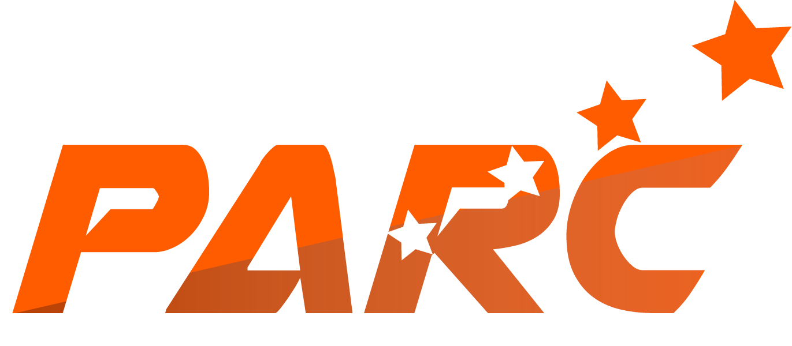

<div align="center">
  
</div>

<br>

<div align="center">

[](https://www.python.org/)
[](https://flask.palletsprojects.com/)
[](https://opencv.org/)
[](https://threejs.org/)
[](LICENSE)

[]()
[]()
[]()
[]()

</div>

---

## Overview

**PARC Robotics SO-101 Controller** is a full-stack web platform for controlling, visualising, and learning with the SO-101 6-DOF robot arm. It runs locally via Flask and exposes a browser-based interface that combines real-time 3D kinematics, AI-powered vision, voice interaction, and structured robotics education — all in one application.

---

## Table of Contents

- [Features](#features)
- [Architecture](#architecture)
- [Project Structure](#project-structure)
- [Requirements](#requirements)
- [Installation](#installation)
- [Running the Application](#running-the-application)
- [Modules](#modules)
- [Hardware Setup](#hardware-setup)
- [Servo Calibration](#servo-calibration)
- [AI Services](#ai-services)
- [MuJoCo Simulation](#mujoco-simulation)
- [Language Support](#language-support)
- [Keyboard Shortcuts](#keyboard-shortcuts)
- [API Reference](#api-reference)
- [Troubleshooting](#troubleshooting)

---

## Features

- **Real-time 3D Visualisation** — Three.js renderer with live forward/inverse kinematics for the SO-101
- **Direct Robot Control** — Joint sliders, preset poses, motion modes, and end-effector position monitoring
- **AI Vision** — Object detection via YOLOE, scene analysis via LFM2.5 Vision (port 8081)
- **Voice Interface** — Speech-to-text via Whisper.cpp, text-to-speech via Piper in multiple languages
- **AI Chat** — LFM2.5 Thinking model for robotics guidance and Q&A (port 8080)
- **Structured Learning** — Beginner → Advanced courses on robotics, kinematics, and AI vision
- **Servo Calibration** — Automated sweep calibration with per-joint min/center/max limits
- **MuJoCo Integration** — Launch the native physics viewer and mirror joint movements to the real arm
- **MediaPipe Tracking** — Face, hand, pose, and body tracking for teleoperation
- **Bilingual UI** — Full English and French support, switchable at runtime

---

## Architecture

```
┌─────────────────────────────────────────────────────────────────┐
│                        Browser (Port 5000)                      │
│   Dashboard  │  Learn  │  Play  │  Settings  │  MuJoCo          │
└──────────────────────────────┬──────────────────────────────────┘
                               │ HTTP / SSE
┌──────────────────────────────▼──────────────────────────────────┐
│                      Flask App (app.py)                          │
│  Routes · REST API · i18n · Servo SDK · Vision · Calibration    │
└────┬──────────────────┬────────────────┬────────────────────────┘
     │ Serial (USB)     │ HTTP           │ subprocess
     ▼                  ▼                ▼
┌─────────┐   ┌─────────────────────┐  ┌──────────────────────┐
│ SO-101  │   │  AI Services        │  │  MuJoCo Viewer       │
│ STS3215 │   │  :8080 LFM2.5 Chat  │  │  viewer.py           │
│ Servos  │   │  :8081 LFM2.5 Vision│  └──────────────────────┘
└─────────┘   │  :8083 YOLOE        │
              │  :8084 Whisper.cpp  │
              │  :8085 Piper TTS    │
              └─────────────────────┘
```

---

## Project Structure

```
parc_final/
├── control_arm/                   # Main Flask application
│   ├── app.py                     # Application entry point (~2800 lines)
│   ├── requirements.txt           # Python dependencies
│   ├── calibration.json           # Servo calibration data
│   ├── servo_ids.json             # Servo ID mappings
│   ├── servo_invert.json          # Per-servo direction flags
│   ├── templates/
│   │   ├── base.html              # Master layout (header, nav, i18n)
│   │   ├── index.html             # Dashboard / module gallery
│   │   └── pages/
│   │       ├── learn.html         # Structured robotics courses
│   │       ├── play.html          # Direct robot control
│   │       └── settings.html      # Configuration & calibration
│   ├── static/
│   │   ├── css/theme.css          # Design system (colors, typography)
│   │   ├── js/
│   │   │   ├── animations.js      # UI transitions
│   │   │   └── robot-arm-3d.js    # Three.js 3D visualiser & kinematics
│   │   ├── urdf/
│   │   │   ├── so101.urdf         # Robot model definition
│   │   │   └── assets/            # STL mesh files
│   │   └── parc-logo.png          # Brand logo
│   ├── translations/
│   │   ├── en.json                # English strings
│   │   └── fr.json                # French strings
│   ├── llama_integration/         # LFM2.5 chat & vision integration
│   │   └── rag/
│   └── STServo_Python/            # Servo motor SDK
├── simulation/                    # MuJoCo simulation environment
│   ├── viewer.py                  # Native viewer (forwards joints to arm)
│   ├── server.py                  # Physics HTTP + WebSocket server
│   ├── bridge.py                  # server.py → real arm bridge
│   └── web/                       # Browser-based 3D viewer (Three.js)
├── InverseKinematics/             # Standalone IK solver
└── README.md
```

---

## Requirements

### System

| Component | Minimum |
|-----------|---------|
| Python | 3.10+ |
| OS | Windows 10/11 or Linux (Ubuntu 20.04+) |
| RAM | 4 GB |
| USB | 1× free port for SO-101 serial connection |
| Camera | Optional (for vision features) |

### Python Dependencies

```
flask>=3.0.0
opencv-python>=4.9.0
mediapipe>=0.10.0
numpy>=1.24.0
pyserial>=3.5
```

### Optional (AI Services — runs on Jetson Orin Nano or local)

| Service | Port | Purpose |
|---------|------|---------|
| LFM2.5 Thinking | 8080 | AI chat, reasoning, robot commands |
| LFM2.5 Vision | 8081 | Scene analysis, grasp position |
| YOLOE | 8083 | Real-time object detection |
| Whisper.cpp | 8084 | Speech-to-text |
| Piper TTS | 8085 | Text-to-speech |

> AI services are optional. The controller, 3D visualiser, and calibration work without them.

---

## Installation

### 1. Clone the repository

```bash
git clone <repository-url>
cd parc_final
```

### 2. Create a virtual environment

```bash
python -m venv venv

# Windows
venv\Scripts\activate

# Linux / macOS
source venv/bin/activate
```

### 3. Install dependencies

```bash
pip install -r control_arm/requirements.txt
```

### 4. Install the servo SDK

The `scservo_sdk` must be placed under `control_arm/stservo-env/`. If you have the SDK source:

```bash
cd control_arm/stservo-env
pip install -e .
```

---

## Running the Application

```bash
cd control_arm
python app.py
```

Then open **http://localhost:5000** in your browser.

The application starts immediately — the robot arm is optional and can be connected from the interface at any time.

---

## Modules

### Dashboard

The entry point. Shows all available modules as cards. Click any card or use its keyboard shortcut to navigate.

### Learn

Structured robotics courses across three levels:

| Level | Topics |
|-------|--------|
| Beginner | Robot anatomy, SO-101 structure, servo control |
| Intermediate | Forward kinematics, inverse kinematics |
| Advanced | Computer vision, MediaPipe integration, AI-assisted control |

Each lesson includes explanations, diagrams, and links to the AI tutor for questions.

### Play

Direct robot control interface:

- **Joint sliders** — control all 6 joints (shoulder pan, shoulder lift, elbow flex, wrist flex, wrist roll, gripper) in real time
- **End-effector display** — live X / Y / Z position readout
- **Motion modes** — pre-built sequences: Idle, Hello, Pick & Place, Dance, Stretch, Salute, Handshake
- **3D visualiser** — live Three.js model that mirrors the physical arm

### Settings

| Section | What it does |
|---------|-------------|
| Language | Switch between English and French |
| Appearance | Choose Dark / Light / Midnight theme and accent colour |
| About | Version info and AI service status |
| Calibration | Automated servo sweep calibration with per-joint limit table |
| System Architecture | Visual diagram of the AI pipeline and service ports |
| Voice | Select TTS voice, preview, and tune speed / pitch / volume |

### MuJoCo Viewer

Launches the native MuJoCo physics viewer as a subprocess. Drag any joint in the viewer to move the virtual arm; a bridge process forwards those joint angles to the real SO-101 in real time.

---

## Hardware Setup

### Connecting the SO-101

1. Plug the SO-101 into a USB port.
2. Note the serial port:
   - **Windows:** `COM3`, `COM21`, etc. (check Device Manager)
   - **Linux:** `/dev/ttyUSB0` or `/dev/ttyACM0`
3. In the web UI, click the **search icon** in the header (or press `D`) to auto-discover and connect.
4. The status indicator in the header turns green when connected.

### Servo ID Mapping

Edit `servo_ids.json` to match your hardware wiring:

```json
{
  "shoulder_pan":  1,
  "shoulder_lift": 2,
  "elbow_flex":    3,
  "wrist_flex":    4,
  "wrist_roll":    5,
  "gripper":       6
}
```

### Servo Direction

If a joint moves in the wrong direction, edit `servo_invert.json`:

```json
{
  "shoulder_pan":  1,
  "shoulder_lift": -1,
  "elbow_flex":    1,
  "wrist_flex":    1,
  "wrist_roll":    1,
  "gripper":       1
}
```

Use `1` for normal direction, `-1` to invert.

---

## Servo Calibration

Calibration determines the physical min / center / max limits of each servo to prevent mechanical damage.

### Steps

1. Connect the robot arm (green indicator in header).
2. Go to **Settings → Calibration**.
3. Adjust the **Sweep Speed** slider (lower = slower, safer for first calibration).
4. Click **Auto Calibrate** — the arm will sweep each joint to its limits.
5. Review the per-joint limit table.
6. Click **Save Calibration** to persist to `calibration.json`.

> **Warning:** Keep clear of the robot during calibration. The arm moves to its physical limits.

### Manual Override

To load a previously saved calibration without re-sweeping, click **Load Calibration**. To reset all joints to their center positions, click **Reset to Center**.

---

## AI Services

### Starting the AI stack

The AI services run separately (typically on a Jetson Orin Nano or a local GPU). Start each service on the expected port before launching the Flask app, or start them at any time — the controller polls them periodically and shows their status in **Settings → About**.

### Voice Commands

1. Ensure Whisper.cpp is running on port 8084 and Piper on port 8085.
2. Open the **Play** module.
3. Click the microphone button, speak a command, click stop.
4. The command is transcribed by Whisper, interpreted by LFM2.5, and executed.

### Vision & Object Detection

1. Ensure YOLOE is running on port 8083.
2. Connect a camera to the robot or your computer.
3. The Play module displays live detections with class labels and confidence scores.

### AI Chat / Tutor

Available in the **Learn** module. Ask any question about robotics, kinematics, or the SO-101. Responses are generated by LFM2.5 Thinking on port 8080.

---

## MuJoCo Simulation

The simulation stack lets you control the virtual arm and mirror those movements to the physical robot.

### Setup

```bash
pip install mujoco websockets numpy trimesh
```

### Option A — Native Viewer (simplest)

```bash
# Terminal 1 — start the controller
cd control_arm && python app.py

# Terminal 2 — launch MuJoCo viewer, forward joints to arm
cd simulation && python viewer.py --controller http://127.0.0.1:5000
```

Hold **Ctrl** and **left-drag** any body part in the viewer to move the arm.

### Option B — Web Viewer + Bridge

```bash
# Terminal 1
cd control_arm && python app.py

# Terminal 2
cd simulation && python server.py
# Open http://localhost:38000

# Terminal 3
cd simulation && python bridge.py
```

### Joint Mapping

| qpos index | MuJoCo joint | Controller joint |
|:---:|:---:|:---:|
| 0 | Rotation | shoulder_pan |
| 1 | Pitch | shoulder_lift |
| 2 | Elbow | elbow_flex |
| 3 | Wrist_Pitch | wrist_flex |
| 4 | Wrist_Roll | wrist_roll |
| 5 | Jaw | gripper |

> MuJoCo uses **radians**; the controller expects **degrees** — the bridge handles conversion automatically.

---

## Language Support

The interface is fully bilingual. Switch language from:

- The **language button** in the top-right header (shows `EN` or `FR`)
- The **Settings → Language** section

Language is stored in a browser cookie and persists across sessions. All UI text, module descriptions, calibration labels, and error messages are translated.

---

## Keyboard Shortcuts

| Key | Action |
|-----|--------|
| `H` | Go to Dashboard |
| `L` | Go to Learn |
| `X` | Go to Play |
| `S` | Go to Settings |
| `M` | Launch MuJoCo Viewer |
| `D` | Discover & connect robot |

Shortcuts are disabled when focus is inside an input field.

---

## API Reference

### Robot Control

| Endpoint | Method | Description |
|----------|--------|-------------|
| `/api/status` | GET | Robot connection status and calibration state |
| `/api/ports` | GET | List available serial ports |
| `/api/connect` | POST | Connect to robot on specified port |
| `/api/disconnect` | POST | Disconnect from robot |
| `/api/robot/state` | GET | Current joint angles and end-effector position |
| `/api/robot/joints` | POST | Send joint angle commands |
| `/api/robot/mode` | POST | Execute a named motion mode |

### Calibration

| Endpoint | Method | Description |
|----------|--------|-------------|
| `/api/calibrate` | POST | Start auto-calibration sweep |
| `/api/calibrate/stop` | POST | Stop calibration in progress |
| `/api/calibrate/save` | POST | Persist calibration to disk |
| `/api/calibrate/load` | POST | Load calibration from disk |

### Vision & AI

| Endpoint | Method | Description |
|----------|--------|-------------|
| `/api/vision/detect_scene` | POST | Run YOLOE detection on current frame |
| `/api/ai/status` | GET | Check AI service availability |
| `/api/ai/plan_pick_place` | POST | AI-assisted pick-and-place planning |
| `/api/audio/speak` | POST | Synthesise speech via Piper TTS |

### Kinematics

| Endpoint | Method | Description |
|----------|--------|-------------|
| `/api/sim/ik` | POST | Compute inverse kinematics for a target position |

### Simulation

| Endpoint | Method | Description |
|----------|--------|-------------|
| `/api/viewer/status` | GET | MuJoCo viewer process status |
| `/api/viewer/start` | POST | Launch MuJoCo viewer subprocess |

### Language

| Endpoint | Method | Description |
|----------|--------|-------------|
| `/api/lang` | GET | Get current language |
| `/api/lang` | POST | Set language (`{ "lang": "fr" }`) |

---

## Troubleshooting

| Symptom | Cause | Fix |
|---------|-------|-----|
| Robot not found after clicking Discover | Wrong port or driver missing | Check Device Manager (Windows) or `ls /dev/tty*` (Linux). Install CH340/CP210x driver if needed. |
| Joints move in wrong direction | Inverted servo wiring | Set the affected servo to `-1` in `servo_invert.json` |
| Calibration fails immediately | Robot not connected | Connect the arm first (green indicator must be active) |
| 3D model not loading | Browser cache or missing URDF assets | Clear cache, verify `static/urdf/` contains `so101.urdf` and `assets/` meshes |
| AI status shows all offline | AI services not running | Start the relevant service(s) on the expected port |
| Language switch has no effect | Cookie blocked | Ensure cookies are enabled for `localhost` |
| MuJoCo viewer fails to launch | `mujoco` not installed | Run `pip install mujoco` in the active environment |
| `ModuleNotFoundError: scservo_sdk` | SDK not installed | Place the SDK under `control_arm/stservo-env/` and run `pip install -e .` |

---

## License

This software is proprietary to **PARC Robotics**. All rights reserved. Unauthorised copying, distribution, or modification is strictly prohibited.

---

<div align="center">
  
  <br><br>
  <sub>© 2025 PARC Robotics. All rights reserved.</sub>
</div>
